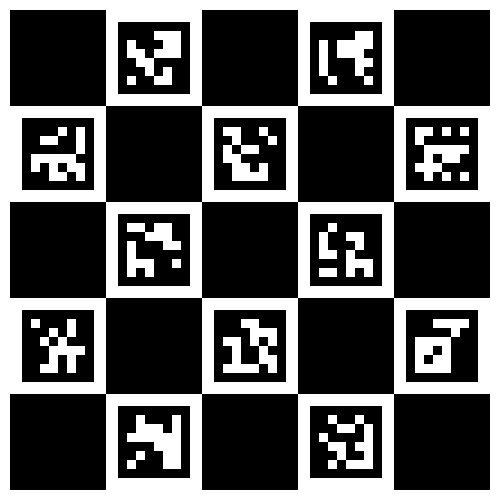

# Vzense カメラキャリブレーションデモ

## 前準備

1. `MC-Calib` リポジトリをクローン：
   ```bash
   git clone https://github.com/rameau-fr/MC-Calib ~/MC-Calib
   ```

2. キャリブレーション用のDockerイメージを取得する：

```bash
docker pull bailool/mc-calib-prod
```

キャリブレーション環境をビルドする：

```bash
docker run -ti --rm \
    --volume="$HOME/MC-Calib:/home/MC-Calib" \
    --volume="$HOME/MC-Calib/data:/home/MC-Calib/data" \
    bailool/mc-calib-prod bash -c "cd /home/MC-Calib && mkdir build && cd build && cmake -DCMAKE_BUILD_TYPE=Release .. && make -j10"
```

```
pip3 install -U pip && pip install pytest jupyter ipython pybsc scikit-robot opencv-python==4.9.0.80
mkdir -p ~/ros/vzense/src/
cd ~/ros/vzense/src/
git clone https://github.com/Vzense/NebulaSDK
git clone --single-branch https://github.com/iory/jsk_demos -b vzense
cd ~/ros/vzense/src/NebulaSDK/ROS2
touch CATKIN_IGNORE
cd ~/ros/vzense/src/NebulaSDK/ROS/src/VzenseROS
python install.py Ubuntu18.04
cd ~/ros/vzense/src/NebulaSDK/ROS/src/VzenseROS_MultiCameras
python install.py Ubuntu18.04
cd ~/ros/vzense
source /opt/ros/noetic/setup.bash
rosdep update
rosdep install --from-paths -i -y -r .
catkin build --cmake-args -DCMAKE_BUILD_TYPE=Release -DCATKIN_WHITELIST_PACKAGES="VzenseROS" -DCATKIN_WHITELIST_PACKAGES="VzenseROS_MultiCameras"
```


## realsense setup (optinal)

```
git clone https://github.com/IntelRealSense/librealsense.git
cd librealsense/
sudo apt install -y git libssl-dev libusb-1.0-0-dev pkg-config libgtk-3-dev
sudo apt install -y libglfw3-dev libgl1-mesa-dev libglu1-mesa-dev
sudo apt install -y cmake
./scripts/setup_udev_rules.sh
mkdir build && cd build
cmake ../ -DCMAKE_BUILD_TYPE=release -DBUILD_EXAMPLES=true -DBUILD_GRAPHICAL_EXAMPLES=true
sudo make clean && make && sudo make install
```

## キャリブレーションボードの準備

キャリブレーションボードがない場合、以下の画像を印刷し、金属などの曲がりにくい面に貼り付ける：




## 2つのカメラでチェッカーボードの画像を集める

1. 2台のVzenseカメラを接続し、IPの設定を行う。

2. 以下のコマンドを実行して、カメラインターフェースを立ち上げる：

```bash
roslaunch vzense_demo calib_vzense.launch
```

3. RVizを使用し、両方のカメラにキャリブレーションボードが映るように調整して、複数の画像を撮影する。

## キャリブレーションの実行

1. 撮影した画像をキャリブレーション用のフォーマットに変換：

```
rosrun vzense_demo aggregate_calib_images.py
```

2. キャリブレーションを実行：

```
docker run -ti --rm \
    --volume="$HOME/MC-Calib:/home/MC-Calib" \
    --volume="$HOME/MC-Calib/data:/home/MC-Calib/data" \
    --volume="$(rospack find vzense_demo)/config/calib_param_two_vzense.yaml:/home/MC-Calib/configs/calib_param_two_vzense.yaml" \
    --volume="$(rospack find vzense_demo)/calib_results:/home/MC-Calib/data/vzense_data" \
    bailool/mc-calib-prod bash -c "cd /home/MC-Calib/build && ./apps/calibrate/calibrate ../configs/calib_param_two_vzense.yaml"
```

## キャリブレーション結果を反映

```
rosrun vzense_demo set_calib_tf.py
```
